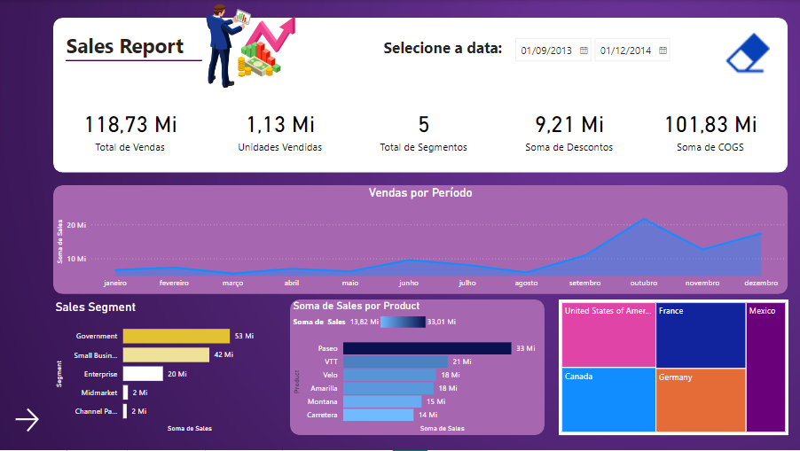
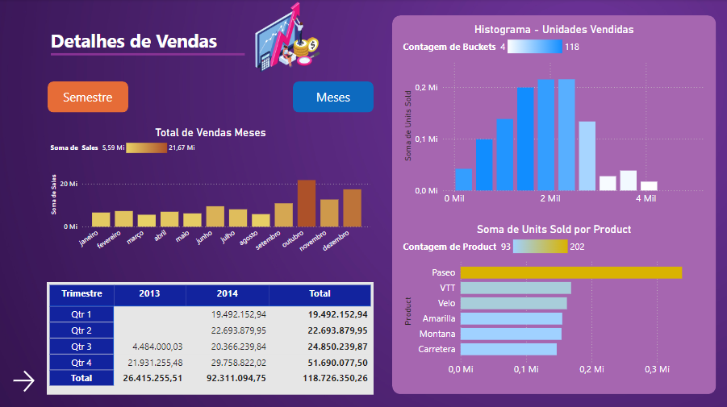
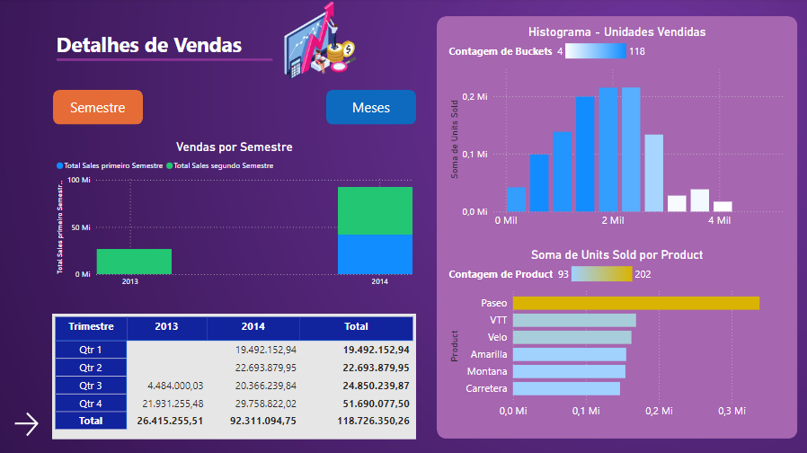
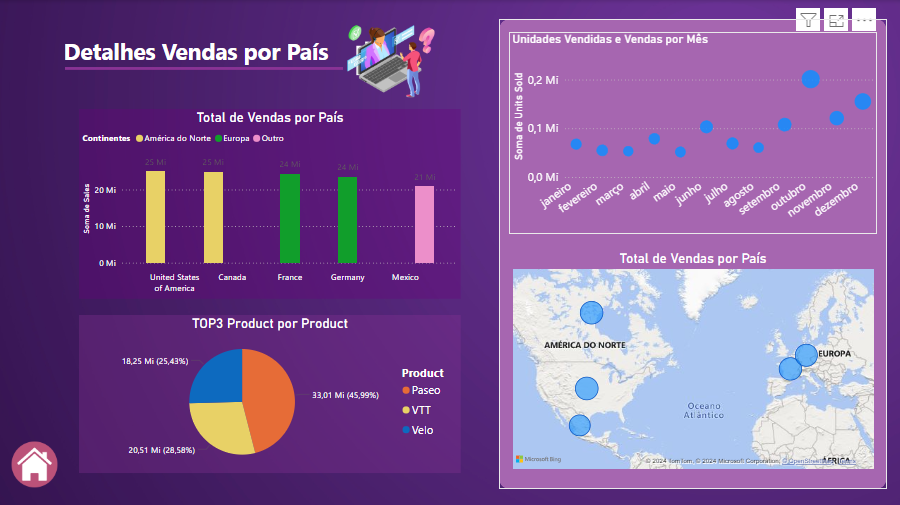

# 💼 Relatórios Financeiros com Power BI: Uma Jornada Visual

**Bem-vindo ao repositório de análises financeiras que transformam números em insights!** 🧩 Neste projeto, você encontrará dashboards dinâmicos desenvolvidos com o poderoso Power BI, que facilitam a interpretação da performance financeira com visualizações intuitivas e detalhadas.

Este projeto faz parte do desafio do curso **"Criando um Relatório de Vendas e Lucros com Data Analytics"**, ministrado por [Juliana Mascarenhas](https://www.linkedin.com/in/juliana-mascarenhas-ds/) no **Bootcamp da [NTT DATA](https://www.linkedin.com/company/ntt-data-europe-latam/posts/?feedView=all) - Engenharia de Dados com Python**, oferecido pela [DIO](https://www.dio.me/).

> 💡 **Nota:** Os dashboards foram criados com base no conjunto de dados **Financial Sample**, fornecido pela própria **Microsoft**, para representar um cenário de análise financeira completo e realista.

 

## 📊 **Dashboards Interativos: Explorando a Paisagem Financeira**

### 1. **Relatório Financeiro** – Resumo Executivo  
   

      
   

   - **Resumo Financeiro:** Informações organizadas em gráficos e tabelas para uma visão clara e completa.
   - **Chamada para Ação:** Botão "Explorar Análise" leva você a insights mais detalhados com um clique.
   - **Design Atraente:** Visualizações modernas e cores vibrantes tornam a análise visualmente envolvente.

### 2. **Sales Report** – Panorama de Vendas  
   

      
   

   - **Desempenho Geral:** Veja rapidamente o total de vendas, unidades vendidas, segmentos e principais custos.
   - **Análise Temporal:** Explore a linha do tempo de vendas por mês e identifique tendências sazonais.
   - **Segmentação de Clientes:** Desempenho por segmentos de clientes para insights de receita por categoria.
   - **Performance por Produto:** Destaque dos produtos mais vendidos e os que precisam de atenção.
   - **Mapa Geográfico:** Distribuição das vendas por país e região para uma visão espacial das oportunidades.

### 3. **Detalhes de Vendas** – Análises Profundas  
   

      
   

   

      
   

   - **Visão Mensal e Semestral:** Dashboard interativo que permite análise detalhada por semestre ou mês.
   - **Gráficos Dinâmicos:** Exibição de vendas por período selecionado com gráficos adaptáveis.
   - **Histograma de Vendas:** Análise da distribuição de unidades vendidas, identificando padrões e outliers.
   - **Performance por Produto:** Identifique os produtos que mais vendem e seu impacto no total.
   - **Tabela de Tendências:** Dados trimestrais e anuais para uma análise completa das vendas.

### 4. **Vendas por País** – Insights Geográficos  
   

      
   

   - **Comparação Continental:** Visualização do total de vendas agrupadas por continente.
   - **Mapa Interativo:** Uma visão global das vendas, com análise detalhada por país.
   - **Padrões Mensais:** Gráfico de variação de vendas mensais por país para identificar sazonalidades.
   - **Top 3 Produtos por País:** Descubra os produtos mais vendidos em cada país.
   - **Análise Regional:** Visão das vendas por continente para uma estratégia geográfica direcionada.

 

## ✨ **Recursos Principais**

- **📊 Análises Interativas:** Cada dashboard permite exploração detalhada dos dados com um simples clique, levando você a insights profundos com rapidez e precisão.
  
- **🔍 Filtros Personalizáveis:** Filtre os dados por **ano**, **mês**, **segmento**, **produto**, e até mesmo por **região** geográfica para adaptar as visualizações às suas necessidades específicas.

- **🌍 Visualização Geográfica:** Os mapas interativos facilitam a análise de vendas e lucros por países e regiões, ajudando a identificar oportunidades e tendências globais.

- **📈 Análise Temporal:** Explore a evolução das métricas financeiras ao longo dos meses e semestres, facilitando a visualização de tendências sazonais e o planejamento estratégico.

- **📑 Variedade de Gráficos:** Gráficos de barras, histogramas, mapas, e tabelas detalhadas permitem que você visualize os dados de formas variadas, garantindo clareza na apresentação de informações complexas.

- **📉 Indicadores Financeiros:** KPIs essenciais, como total de vendas, lucro bruto, soma de custos e descontos, ficam em destaque para que você tenha uma visão clara do desempenho financeiro geral.

Esses recursos tornam a análise dos dados financeiros **clara, objetiva e orientada a decisões**, facilitando o uso das informações para planejar estratégias com impacto real.

 

## 🔧 **Ferramentas Utilizadas**

- **Microsoft Power BI:** Plataforma principal para conectar dados, criar dashboards interativos e construir uma experiência de análise visualmente atraente e prática.

 

## 🚀 **Como Explorar o Projeto**

1. **Clone o Repositório:** Use Git para clonar o repositório em sua máquina.
2. **Abra no Power BI Desktop:** Com o Power BI Desktop instalado, abra o arquivo `.pbix`.
3. **Explore e Interaja:** Navegue entre os dashboards, explore os filtros e visualize os dados com profundidade.

> **Observação:** Você precisará do Power BI Desktop para visualizar e interagir com os dashboards.

 

## 👨‍💻 Expert

    
    
&nbsp&nbsp&nbspMarcos Winther 
    &nbsp&nbsp&nbsp
    <a href="https://github.com/MarcosWinther">
    GitHub</a>&nbsp;|&nbsp;
    <a href="https://www.linkedin.com/in/marcoswinthersilva/">LinkedIn</a>
    

  

---

⌨️ com 💜 por [Marcos Winther](https://github.com/MarcosWinther)